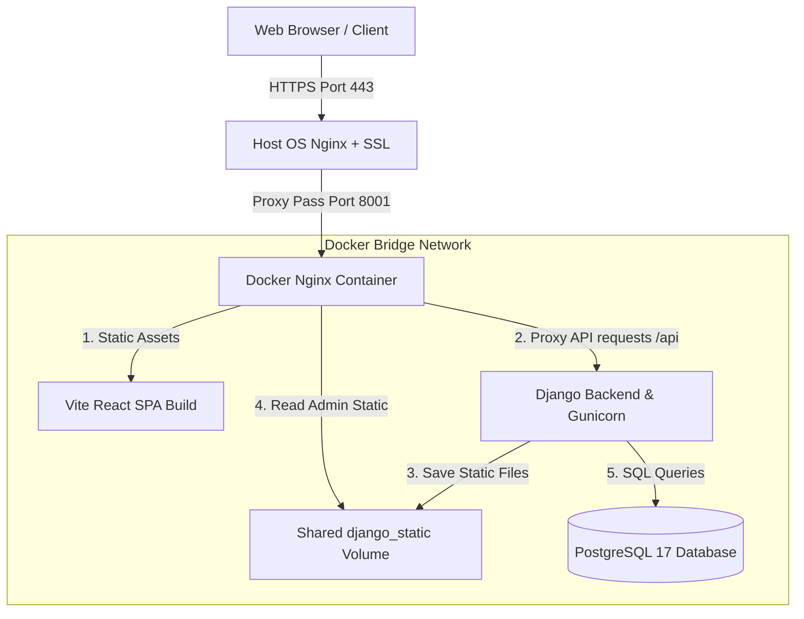

# 🌐 RepairBharat - VPS Production Deployment Guide

This guide provides step-by-step instructions for deploying the **RepairBharat** production-grade, decoupled "Repair Operating System" to a Virtual Private Server (VPS) (e.g., DigitalOcean, AWS, Linode, Hetzner) using **Docker**, **Docker Compose**, and **Nginx**.

---

## 🏗️ Production Architecture Overview

The production environment is orchestrated using multi-container Docker services:

1. **Database Service (`db`)**: Runs a secured **PostgreSQL 17** engine, with its storage persisted inside a Docker volume (`postgres_data`). For safety, its port is bound only to `127.0.0.1` (localhost), preventing direct exposure to the public internet.
2. **Backend Service (`backend`)**: A high-performance **Django DRF** application running under **Gunicorn** with 3 worker processes.
3. **Nginx/Frontend Service (`nginx`)**: Serves the fully optimized, production-compiled **React SPA bundle** and acts as a reverse proxy, routing `/api/`, `/accounts/`, and `/admin/` requests directly to the Django backend. It also serves Django's backend static files using a shared Docker volume (`django_static`).



---

## 📋 1. Prerequisites

Before starting, ensure your VPS is configured with:
* **Operating System**: Ubuntu 22.04 LTS or any modern Linux distribution.
* **Docker Engine** (v24.0+) & **Docker Compose** (v2.0+).
  * *Tip*: Install via the official Docker guide or run `sudo apt update && sudo apt install -y docker.io docker-compose-v2`.
* **Git** installed on the server to pull the codebase.
* **A Domain Name** (e.g., `repairbharat.yourdomain.com`) pointing to your VPS public IP address via an **A Record** (highly recommended for SSL setup).

---

## ⚙️ 2. Configuration Setup

### Step A: Configure Production Environment Variables

1. Clone or copy your project folder to your VPS:
   ```bash
   git clone <your-repository-url> /var/www/repairbharat
   cd /var/www/repairbharat
   ```

2. Open the `.env.prod` file located inside the `backend/` directory:
   ```bash
   nano backend/.env.prod
   ```

3. Update the values with secure parameters. **Do not use default credentials in production!**

   ```ini
   # ─── DJANGO PRODUCTION SETTINGS ───
   DEBUG=False
   # Generate a secure secret key using: openssl rand -hex 32
   DJANGO_SECRET_KEY=replace-with-a-secure-random-64-character-string
   
   # Set this to your VPS public IP and your production domain
   DJANGO_ALLOWED_HOSTS=repairbharat.yourdomain.com,123.45.67.89,localhost
   
   # Add your domain with http:// and https:// schemes for CSRF security validation
   DJANGO_CSRF_TRUSTED_ORIGINS=https://repairbharat.yourdomain.com,http://repairbharat.yourdomain.com,http://localhost:8001
   
   # ─── DATABASE SETTINGS ───
   DATABASE_ENGINE=postgresql
   DATABASE_NAME=repairbharatdb
   DATABASE_USERNAME=repair_admin
   # Choose a strong password
   DATABASE_PASSWORD=choose_a_strong_database_password
   DATABASE_HOST=db
   DATABASE_PORT=5432
   
   # ─── POSTGRES CONTAINER SETTINGS (Must match Database Settings above) ───
   POSTGRES_DB=repairbharatdb
   POSTGRES_USER=repair_admin
   POSTGRES_PASSWORD=choose_a_strong_database_password
   ```

---

## 🚀 3. Deploying the Containers

To build the React production bundle, compile Nginx, pull PostgreSQL, and start the system, execute:

```bash
# Start all containers in detached (background) mode
docker compose up -d --build
```

### Verify Container Status
Check that all three containers are active:
```bash
docker compose ps
```

Expected Output:
```
NAME             IMAGE                     COMMAND                  SERVICE   CREATED         STATUS         PORTS
django-backend   repairbharat-backend      "/app/entrypoint.pro…"   backend   2 minutes ago   Up 2 minutes   8000/tcp
nginx-proxy      repairbharat-nginx        "/docker-entrypoint.…"   nginx     2 minutes ago   Up 2 minutes   0.0.0.0:8001->80/tcp, :::8001->80/tcp
repairbharat-db  postgres:17               "docker-entrypoint.s…"   db        2 minutes ago   Up 2 minutes   127.0.0.1:5432->5432/tcp
```

---

## 💾 4. Database Initialization & Seeding

Since the PostgreSQL container starts blank, you must run migrations and seed the workspace structure.

### Step A: Run Django Migrations (Automatic)
Django migrations are executed automatically during the container's startup via `entrypoint.prod.sh`. You can verify this by viewing the backend logs:
```bash
docker compose logs backend
```

### Step B: Run Sandbox Seeding (Recommended for first boot)
To prepopulate the system with default test pipelines, repair skills, verified Mumbai/Delhi/Bengaluru branches, spare inventory catalogs, and repair orders, trigger the seed script **inside** the backend container:

```bash
docker compose exec backend python seed_data.py
```

> [!WARNING]
> The `seed_data.py` script is designed to clear and reset structural records to prevent duplicate key errors in sandbox testing. **Do not run this script on an active production system once real user data has been accumulated.**

### Step C: Create a Django Admin Superuser
To access the database and manage models directly via the `/admin` workspace:

```bash
docker compose exec backend python manage.py createsuperuser
```
Follow the interactive prompts to set your administrator username, email, and password.

---

## 🔒 5. Securing with SSL (HTTPS) via Host Nginx

For a production deployment, exposing cleartext HTTP on port `8001` or `80` is insecure. The industry standard is to place the Docker containers behind a host-level Nginx reverse proxy equipped with Let's Encrypt SSL certificates.

### Step A: Install Nginx & Certbot on Host VPS
```bash
sudo apt update
sudo apt install -y nginx certbot python3-certbot-nginx
```

### Step B: Create Nginx Virtual Host Config
Create a new configuration block for your site:
```bash
sudo nano /etc/nginx/sites-available/repairbharat
```

Paste the following configuration, replacing `repairbharat.yourdomain.com` with your real domain:
```nginx
server {
    listen 80;
    server_name repairbharat.yourdomain.com;

    # Redirect all HTTP requests to HTTPS
    location / {
        return 301 https://$host$request_uri;
    }
}

server {
    listen 443 ssl;
    server_name repairbharat.yourdomain.com;

    # SSL Certificates (will be configured by Certbot automatically)
    # ssl_certificate ...
    # ssl_certificate_key ...

    # Security Headers
    add_header X-Frame-Options "SAMEORIGIN" always;
    add_header X-XSS-Protection "1; mode=block" always;
    add_header X-Content-Type-Options "nosniff" always;
    add_header Referrer-Policy "no-referrer-when-downgrade" always;
    add_header Content-Security-Policy "default-src 'self' http: https: data: blob: 'unsafe-inline'" always;

    # Proxy to Docker Nginx container
    location / {
        proxy_pass http://127.0.0.1:8001;
        proxy_set_header Host $host;
        proxy_set_header X-Real-IP $remote_addr;
        proxy_set_header X-Forwarded-For $proxy_add_x_forwarded_for;
        proxy_set_header X-Forwarded-Proto $scheme;
        
        # Support WebSockets (if needed in the future)
        proxy_http_version 1.1;
        proxy_set_header Upgrade $http_upgrade;
        proxy_set_header Connection "upgrade";
    }
}
```

### Step C: Enable Site & Restart Nginx
```bash
# Enable the site configuration
sudo ln -s /etc/nginx/sites-available/repairbharat /etc/nginx/sites-enabled/

# Test the Nginx syntax for errors
sudo nginx -t

# Restart Nginx on the host
sudo systemctl restart nginx
```

### Step D: Obtain Let's Encrypt SSL Certificate
Run Certbot to automatically fetch, configure, and auto-renew your SSL certificate:
```bash
sudo certbot --nginx -d repairbharat.yourdomain.com
```
Certbot will modify `/etc/nginx/sites-available/repairbharat` to point to the active SSL certificates.

---

## 🛠️ 6. Maintenance & Troubleshooting

### How to start, stop, and restart services
```bash
# Start background services
docker compose start

# Stop background services
docker compose stop

# Restart all containers
docker compose restart

# Completely stop and tear down containers (preserves database volumes)
docker compose down
```

### How to inspect runtime logs
To inspect overall services or debug individual container failures:
```bash
# Follow overall logs
docker compose logs -f

# Read only backend logs
docker compose logs -f backend

# Read only Nginx routing/proxy logs
docker compose logs -f nginx
```

### Common Pitfall: `CSRF verification failed` (Forbidden 403)
If you receive a CSRF error when logging in or making API requests, it is because your browser is sending a request from a domain that is not trusted by Django.
* **Fix**: Ensure that your domain name is added **exactly** (with `https://` or `http://` prefix) in the `DJANGO_CSRF_TRUSTED_ORIGINS` environment variable inside `backend/.env.prod`. Then restart the containers:
  ```bash
  docker compose down && docker compose up -d
  ```

---

## 🔑 Sandbox Credentials Cheat Sheet
If you have seeded the database, you can log in immediately using these pre-configured user credentials:

| Username | Password | Role | Actions to test |
| :--- | :--- | :--- | :--- |
| **`customer1`** | `password123` | B2C Customer | Browse workshops on Mumbai proximity radar, book repairs. |
| **`owner1`** | `password123` | Shop Owner / Admin | Manage kanban desk, update stock inventory, print bills. |
| **`tech1`** | `password123` | Bench Specialist | Access bench checklist queue, advance repair milestones. |
